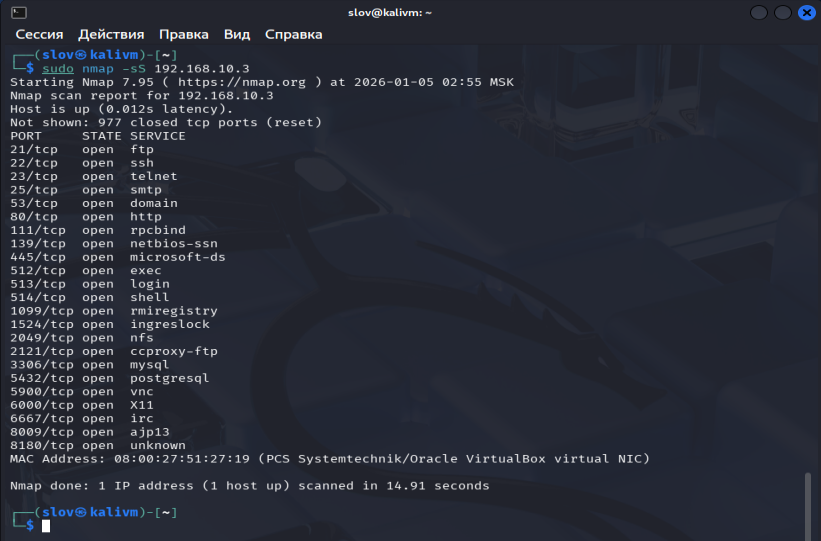
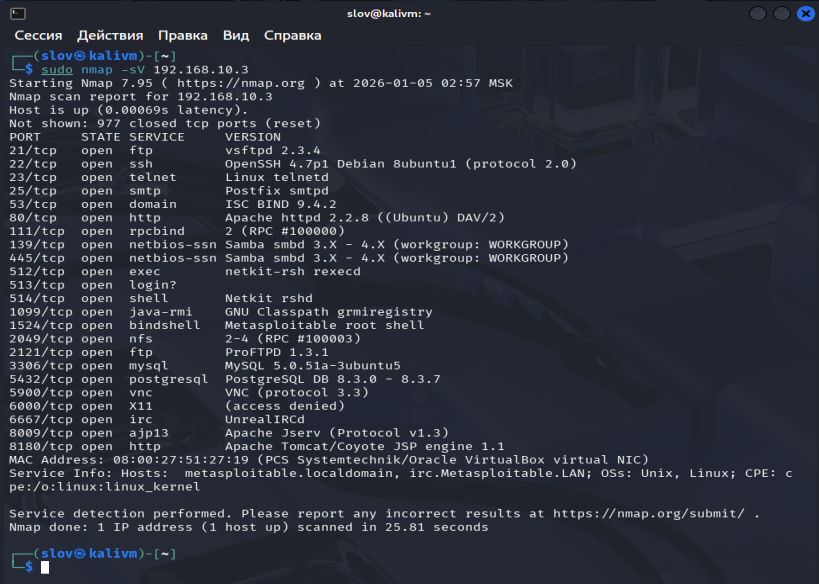
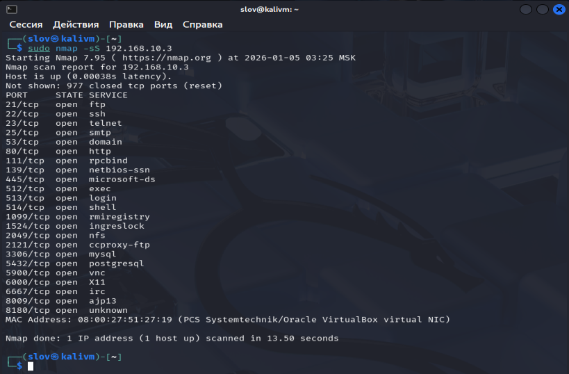
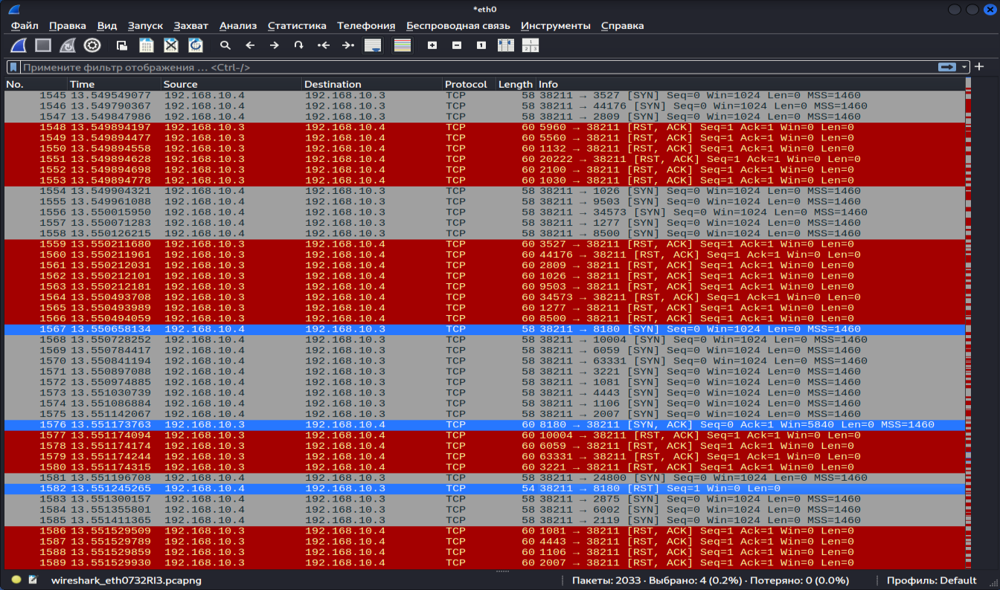
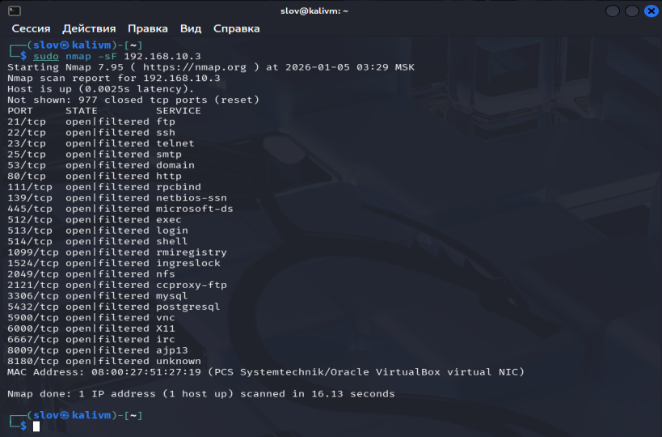
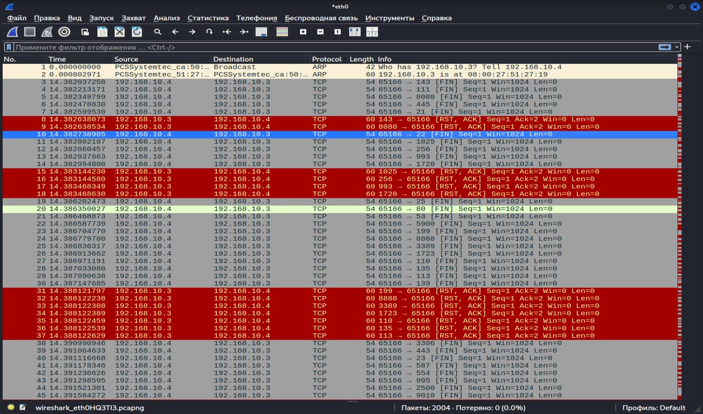
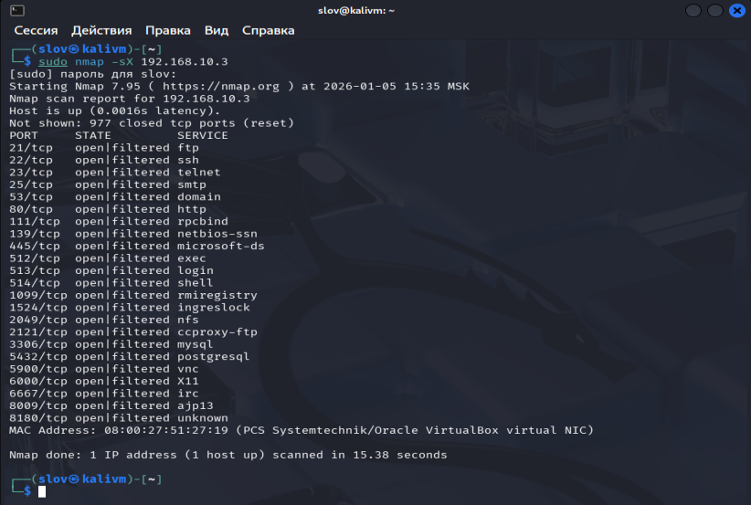
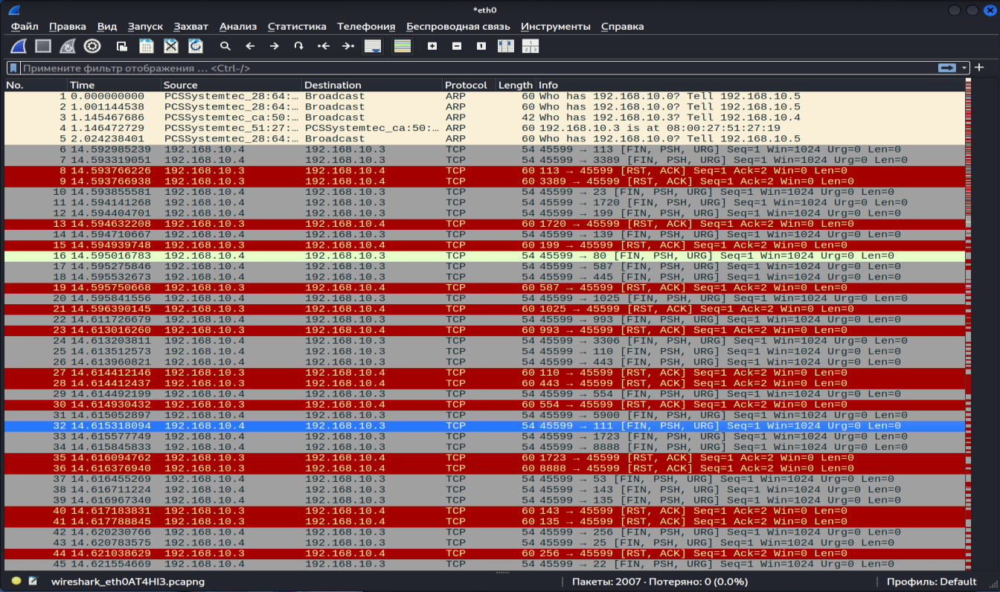
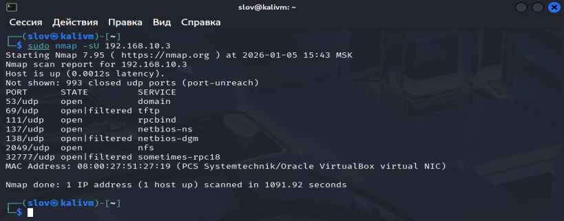
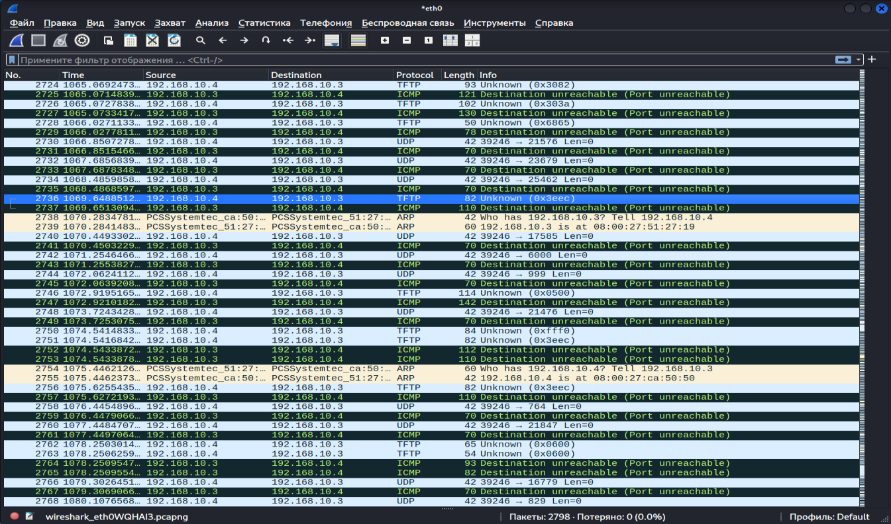

# Домашнее задание к занятию "`Уязвимости и атаки на информационные системы`" - `Рахманов Александр`

### Инструкция по выполнению домашнего задания

   1. Сделайте `fork` данного репозитория к себе в Github и переименуйте его по названию или номеру занятия, например, https://github.com/имя-вашего-репозитория/git-hw или  https://github.com/имя-вашего-репозитория/7-1-ansible-hw).
   2. Выполните клонирование данного репозитория к себе на ПК с помощью команды `git clone`.
   3. Выполните домашнее задание и заполните у себя локально этот файл README.md:
      - впишите вверху название занятия и вашу фамилию и имя
      - в каждом задании добавьте решение в требуемом виде (текст/код/скриншоты/ссылка)
      - для корректного добавления скриншотов воспользуйтесь [инструкцией "Как вставить скриншот в шаблон с решением](https://github.com/netology-code/sys-pattern-homework/blob/main/screen-instruction.md)
      - при оформлении используйте возможности языка разметки md (коротко об этом можно посмотреть в [инструкции  по MarkDown](https://github.com/netology-code/sys-pattern-homework/blob/main/md-instruction.md))
   4. После завершения работы над домашним заданием сделайте коммит (`git commit -m "comment"`) и отправьте его на Github (`git push origin`);
   5. Для проверки домашнего задания преподавателем в личном кабинете прикрепите и отправьте ссылку на решение в виде md-файла в вашем Github.
   6. Любые вопросы по выполнению заданий спрашивайте в чате учебной группы и/или в разделе “Вопросы по заданию” в личном кабинете.
   
Желаем успехов в выполнении домашнего задания!
   
### Дополнительные материалы, которые могут быть полезны для выполнения задания

1. [Руководство по оформлению Markdown файлов](https://gist.github.com/Jekins/2bf2d0638163f1294637#Code)

---

### Задание 1

Скачайте и установите виртуальную машину Metasploitable: https://sourceforge.net/projects/metasploitable/.
Это типовая ОС для экспериментов в области информационной безопасности, с которой следует начать при анализе уязвимостей. Просканируйте эту виртуальную машину, используя nmap.
Попробуйте найти уязвимости, которым подвержена эта виртуальная машина.
Сами уязвимости можно поискать на сайте https://www.exploit-db.com/.
Для этого нужно в поиске ввести название сетевой службы, обнаруженной на атакуемой машине, и выбрать подходящие по версии уязвимости.

Ответьте на следующие вопросы:
    Какие сетевые службы в ней разрешены?
    Какие уязвимости были вами обнаружены? (список со ссылками: достаточно трёх уязвимостей)

Приведите ответ в свободной форме.

### Решение

Сетевые службы, разрешённые на "атакуемой" машине.

Обнаруженные уязвимости (частичная выборка)

1. vsftpd 2.3.4 - [Backdoor Command Execution](https://www.exploit-db.com/exploits/49757)
2. vsftpd 2.3.4 - [Backdoor Command Execution (Metasploit)](https://www.exploit-db.com/exploits/17491)
3. PostgreSQL 8.3.6 - [Conversion Encoding Remote Denial of Service](https://www.exploit-db.com/exploits/32849)
4. PostgreSQL 8.3.6 - [Low Cost Function Information Disclosure](https://www.exploit-db.com/exploits/32847)
5. UnrealIRCd 3.2.8.1 - [Local Configuration Stack Overflow](https://www.exploit-db.com/exploits/18011)
6. UnrealIRCd 3.2.8.1 - [Remote Downloader/Execute](https://www.exploit-db.com/exploits/13853)

---

### Задание 2

Проведите сканирование Metasploitable в режимах SYN, FIN, Xmas, UDP.
Запишите сеансы сканирования в Wireshark.

Ответьте на следующие вопросы:
    Чем отличаются эти режимы сканирования с точки зрения сетевого трафика?
    Как отвечает сервер?

Приведите ответ в свободной форме.

### Решение

#### Режим TCP SYN

В режиме SYN отправляется пакет с флагом SYN для установки соединения. Ответ SYN/ACK - порт открыт (После происходит сброс соединения RST). Ответ RST/ACK - порт закрыт.

#### Режим TCP FIN

В режиме FIN отправляется пакет с флагом FIN. Ответ RST/ACK - порт закрыт. Если ответа нет - порт открыт|фильтруется.

#### Режим Xmas

В режиме Xmas отправляется пакет с флагами FIN/PSH/URG. Ответ RST/ACK - порт закрыт. Если ответа нет - порт открыт|фильтруется.

#### Режим UDP

В режиме Xmas отправляется пакет с флагами FIN/PSH/URG. Ответ RST/ACK - порт закрыт. Если ответа нет - порт открыт|фильтруется.

---
